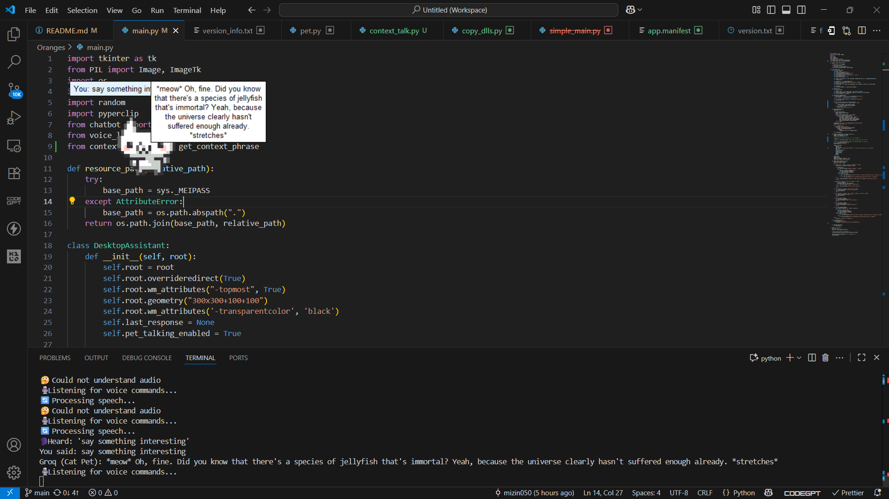

# Wiskers - The Desktop Pet 🐱

## Basic Details

### Team Name: Whiskerious

### Team Members
- Team Lead: Mizin Sadikh - Muthoot Institute of Technology and Science
- Member 2: Mirza Talha Baig - Muthoot Institute of Technology and Science


### Project Description

A charming desktop pet that provides delightful company during your computer sessions. It's a completely unnecessary but adorable addition to your desktop experience.

### The Problem (that doesn't exist)

Let’s be honest, working at your computer can get boring. Sure, you could play music or talk to friends, but where’s the fun in that when you could have a tiny cat hovering on your screen, silently judging your life choices?

### The Solution (that nobody asked for)

So, we built Oranges a snarky little desktop cat that chats with you, reacts to your voice, steals a peek at your clipboard, and throws in a meow or two just to keep you humble.


## Technical Detail
- **Voice Commands** — Talk to your pet and get begrudgingly useful answers.
- **Groq AI Brain** — Powered by LLaMA 3 (`llama3-70b-8192`) for witty, concise responses.
- **Clipboard Reading** — “Answer this” will make it read & reply to your clipboard text.
- **Copy Last Reply** — “Copy that” saves the last sarcastic gem to your clipboard.
- **Computer Locking** — “Lock screen” for instant privacy.
- **Pet Control** — Tell it to “stop talking” or “start talking” as you wish.
- **Animated Sprites** — Cute (and judgmental) idle animations from `assets/`.

### Technologies/Components Used

For Software:

- Python 3.13
- Tkinter (GUI Framework)
- PIL/Pillow (Image Processing)
- PyInstaller (Executable Creation)
- Auto-py-to-exe (Alternative Build Tool)

### Implementation

For Software:
```
# Installation

````bash
# Clone the repository
git clone https://github.com/mizin050/Oranges.git

# Install required packages
pip install -r requirements.txt

# Run

```bash
python main.py
or
Download and run the .exe file
```
### Project Documentation

For Software:

# Screenshots


_existing_


_talking back_

.png>)
_Oranges in their default idle animation_

### Project Demo

# Video

-[Video Link](https://drive.google.com/file/d/1scU8ZiQAsOZyeKiw_YF2UwJlVDt_jl_W/view?usp=sharing)

# Additional Demos

- Different animation sets available in the assets folder
- Right-click to close the application
- Left-click and drag to move Wiskers around

## Team Contributions
Mizin Sadikh : Cat Brain & Voice
- Integrated Groq API with LLaMA 3 model for sarcastic, short responses
- Wrote chatbot.py logic to handle prompts and responses
- Designed system prompt to give the cat its personality
- Implemented voice recognition with SpeechRecognition.
- Added voice command handling for clipboard reading, copying, locking screen, and muting/unmuting.

Mirza Talha Baig : Cat Body & UI
- Built Tkinter-based floating, transparent, always-on-top pet window
- Added sprite animation system with idle/default and alternate animations
- Implemented speech bubble UI for showing messages
- Managed image loading, resizing, and asset handling from assets/
- Developed random idle animation switching logic

---

Made with ❤️ at TinkerHub Useless Projects


````


